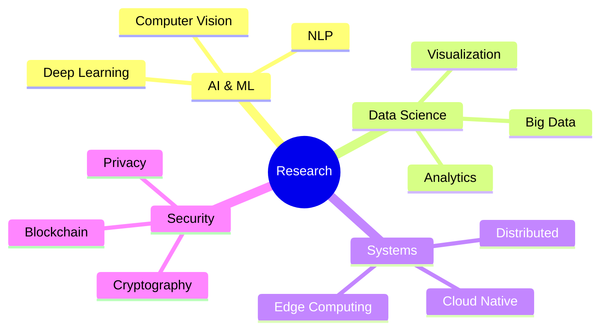
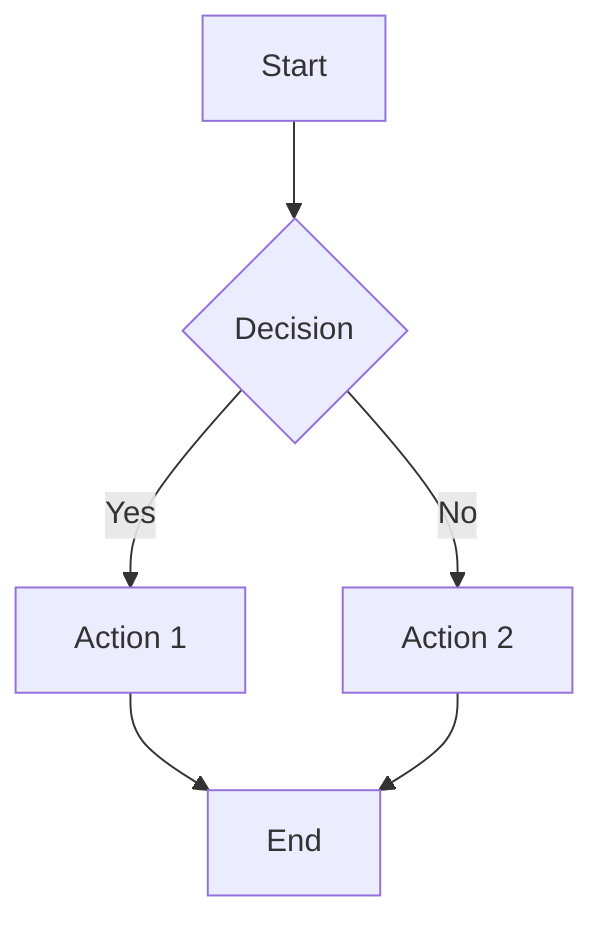
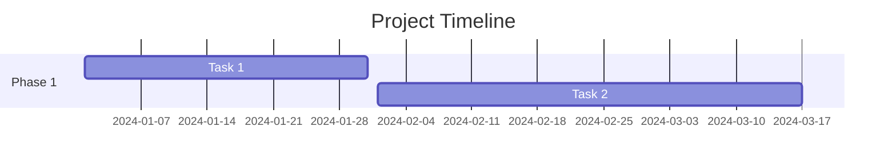
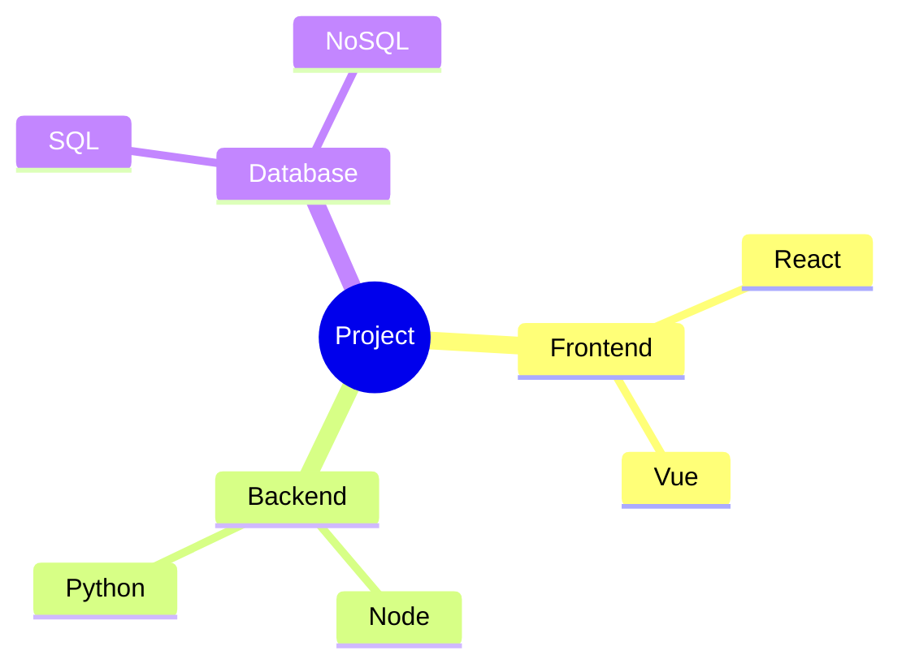

# 🎨 Organization Profile Design Examples

This document showcases multiple high-tech, modern, stylish organization profile page examples and design patterns that can be used or adapted.

---

## 🌟 Example 1: Minimalist Tech

<div align="center">

```
╔══════════════════════════════════════════════════════════╗
║                                                          ║
║           🚀  ORGANIZATION  NAME                         ║
║                                                          ║
║        Building Tomorrow's Technology Today             ║
║                                                          ║
╚══════════════════════════════════════════════════════════╝
```

[](https://example.com)
[](https://docs.example.com)
[](https://api.example.com)

</div>

### Clean & Focused

```markdown
## What We Do
> Simplifying complex problems with elegant solutions

### Technology
`AI` · `Cloud` · `Open Source` · `Web3`

### Projects
→ [Project Alpha](#) - Next-gen platform  
→ [Project Beta](#) - AI toolkit  
→ [Project Gamma](#) - Developer tools
```

---

## 🎯 Example 2: Cyberpunk/Futuristic

<div align="center">

```
╔════════════════════════════════════════════════════╗
║  ██╗   ██╗██╗ ██████╗ ██╗     ███████╗████████╗  ║
║  ██║   ██║██║██╔═══██╗██║     ██╔════╝╚══██╔══╝  ║
║  ██║   ██║██║██║   ██║██║     █████╗     ██║     ║
║  ╚██╗ ██╔╝██║██║   ██║██║     ██╔══╝     ██║     ║
║   ╚████╔╝ ██║╚██████╔╝███████╗███████╗   ██║     ║
║    ╚═══╝  ╚═╝ ╚═════╝ ╚══════╝╚══════╝   ╚═╝     ║
╚════════════════════════════════════════════════════╝
```


</div>

### Neon & Electric

```markdown
## > SYSTEM STATUS_
```
[████████████████████████████] 100% OPERATIONAL
```

### > CORE_MODULES_
- ⚡ **NEURAL.NETWORK** → AI Processing  
- 🔐 **SECURITY.CORE** → Zero-Trust Auth  
- 🌐 **WEB.MATRIX** → Distributed Systems  
- 📡 **DATA.STREAM** → Real-time Analytics

### > ACCESS_POINTS_
[[ENTER]](https://github.com) [[DOCS]](https://docs) [[API]](https://api)
```

---

## 💎 Example 3: Elegant Corporate

<div align="center">


### *Transforming Ideas Into Reality*

---

**TRUSTED BY LEADING ORGANIZATIONS WORLDWIDE**


</div>

### Professional & Trustworthy

```markdown
## Our Solutions

| Solution | Description | Status |
|----------|-------------|--------|
| **Platform Pro** | Enterprise-grade infrastructure | ✅ Production |
| **Analytics Suite** | Real-time business intelligence | ✅ Production |
| **Security Shield** | Advanced threat protection | 🔄 Beta |
| **AI Insights** | Predictive analytics engine | 🔄 Beta |

## Why Choose Us?

✓ **20+ Years** of industry experience  
✓ **Fortune 500** clients worldwide  
✓ **24/7 Support** with 99.9% SLA  
✓ **Enterprise Security** certifications
```

---

## 🌈 Example 4: Creative & Colorful

<div align="center">

# 🎨 Creative Co.

**WHERE IMAGINATION MEETS INNOVATION**


</div>

### Vibrant & Dynamic

```markdown
## 🎯 What We're About

🎨 **Design** → Beautiful, intuitive experiences  
⚡ **Performance** → Lightning-fast solutions  
🔒 **Security** → Fort Knox level protection  
🌍 **Global** → Serving users worldwide

## 🏆 Featured Work

<table>
<tr>
<td>
  
  <br />
  <b>Visual Platform</b>
</td>
<td>
  
  <br />
  <b>Creative Suite</b>
</td>
<td>
  
  <br />
  <b>Design System</b>
</td>
</tr>
</table>
```

---

## 🔬 Example 5: Scientific & Data-Driven

<div align="center">

# 🔬 Research Labs

*Advancing Science Through Technology*


</div>

### Academic & Professional

```markdown
## Research Areas



## Recent Publications

1. **"Advanced Neural Networks for Edge Computing"**  
   *Journal of AI Research, 2024* | [DOI](https://doi.org) | 📊 45 citations

2. **"Quantum-Resistant Cryptography Implementation"**  
   *Security Conference, 2024* | [DOI](https://doi.org) | 📊 28 citations

3. **"Scalable ML Pipelines in Production"**  
   *MLOps Summit, 2024* | [DOI](https://doi.org) | 📊 67 citations
```

---

## 🎮 Example 6: Gaming/Interactive

<div align="center">

```
    _____ _____ _____ _____ 
   |     |  _  |     |   __|
   | | | |     | | | |   __|
   |_|_|_|__|__|_|_|_|_____|
   
   █▓▒░ LEVEL UP YOUR CODE ░▒▓█
```


</div>

### Fun & Engaging

```markdown
## 🎯 Quest Log

- [x] ⚔️ **Main Quest**: Build the Platform (COMPLETE)
- [x] 🛡️ **Side Quest**: Add Authentication (COMPLETE)
- [ ] 🗝️ **Main Quest**: Launch API v2.0 (IN PROGRESS)
- [ ] 💎 **Side Quest**: Community Portal (QUEUED)

## 🏅 Achievements Unlocked

| Achievement | Description | Rarity |
|-------------|-------------|--------|
| 🌟 **First Star** | Reached 100 stars | ⭐ Common |
| 🚀 **Contributor** | 50+ contributors | ⭐⭐ Uncommon |
| 💎 **1K Club** | 1000+ stars | ⭐⭐⭐ Rare |
| 🏆 **Legend** | 10K+ downloads | ⭐⭐⭐⭐ Legendary |

## 🎮 Power-Ups Available

→ Premium Support  
→ Advanced Features  
→ Custom Integrations  
→ Priority Access
```

---

## 🌌 Example 7: Space/Cosmic Theme

<div align="center">

# 🌌 STELLAR SYSTEMS


*Reaching for the Stars, Building for Tomorrow*

[](https://github.com)
[](https://github.com)
[](https://github.com)

</div>

### Cosmic & Expansive

```markdown
## 🌠 Mission Control

### Current Missions

```text
┌─────────────────────────────────────┐
│ 🛸 MISSION ALPHA    [████████] 100% │
│ 🌍 MISSION BETA     [██████--]  75% │
│ 🔭 MISSION GAMMA    [████----]  50% │
│ ⭐ MISSION DELTA    [██------]  25% │
└─────────────────────────────────────┘
```

### 🌟 Star Systems (Repositories)

| System | Status | Planets | Life Forms |
|--------|--------|---------|------------|
| 🌐 Alpha Centauri | Active | 5 repos | 120 contributors |
| 🔴 Mars Colony | Building | 3 repos | 45 contributors |
| 🌙 Luna Base | Planned | 1 repo | 12 contributors |

### 🚀 Launch Schedule

- **Q1 2025**: Web Platform 3.0
- **Q2 2025**: Mobile Apps Suite
- **Q3 2025**: AI Integration Hub
- **Q4 2025**: Developer Portal
```

---

## 💡 Design Elements Library

### Badges & Shields

```markdown
<!-- Status Badges -->


<!-- Social Badges -->


<!-- Technology Badges -->


```

### ASCII Art Headers

```
Option 1 - Bold:
███████╗██╗   ██╗███████╗████████╗███████╗███╗   ███╗███████╗
██╔════╝╚██╗ ██╔╝██╔════╝╚══██╔══╝██╔════╝████╗ ████║██╔════╝
███████╗ ╚████╔╝ ███████╗   ██║   █████╗  ██╔████╔██║███████╗
╚════██║  ╚██╔╝  ╚════██║   ██║   ██╔══╝  ██║╚██╔╝██║╚════██║
███████║   ██║   ███████║   ██║   ███████╗██║ ╚═╝ ██║███████║
╚══════╝   ╚═╝   ╚══════╝   ╚═╝   ╚══════╝╚═╝     ╚═╝╚══════╝

Option 2 - Blocky:
 ____  _  _  ____  ____  ____  _  _  ____ 
/ ___)( \/ )/ ___)(_  _)(  __)( \/ )/ ___)
\___ \ )  / \___ \  )(   ) _) / \/ \\___ \
(____/(__/  (____/ (__) (____)\_)(_/(____/

Option 3 - Simple:
╔═══════════════════════════════════════╗
║         ORGANIZATION NAME             ║
║      Building the Future Today        ║
╚═══════════════════════════════════════╝
```

### Progress Bars

```markdown
<!-- Text-based -->
[████████████████████] 100% Complete
[████████████--------]  60% In Progress
[█████---------------]  25% Starting

<!-- Emoji-based -->
🟦🟦🟦🟦🟦🟦🟦🟦🟦🟦 100%
🟩🟩🟩🟩🟩🟩⬜⬜⬜⬜  60%
🟨🟨🟨⬜⬜⬜⬜⬜⬜⬜  30%
```

### Animated Elements

```markdown
<!-- Typing effect -->
[](https://git.io/typing-svg)

<!-- Wave header -->


<!-- Wave footer -->

```

### Statistics & Metrics

```markdown
<!-- GitHub Stats -->


<!-- Streak Stats -->


<!-- Language Stats -->


<!-- Activity Graph -->

```

### Mermaid Diagrams

```markdown
<!-- Flowchart -->


<!-- Timeline -->


<!-- Mind Map -->

```

---

## 🎨 Color Schemes

### Tech Purple
```
#240046 #3C096C #560BAD #7209B7 #9D4EDD #C77DFF #E0AAFF
```

### Ocean Blue
```
#012A4A #013A63 #01497C #014F86 #2A6F97 #2C7DA0 #468FAF #61A5C2
```

### Neon Cyber
```
#00FF00 #00FFFF #FF00FF #FFFF00 #FF0000 #0000FF
```

### Corporate Grey
```
#2B2D42 #8D99AE #EDF2F4 #EF233C #D80032
```

### Sunset Gradient
```
#FF6B6B #FFA500 #FFD93D #6BCF7F #4ECDC4 #45B7D1 #5F6CAF
```

---

## 📝 Best Practices

1. **Keep it Visual**: Use badges, images, and charts
2. **Be Consistent**: Maintain brand colors and style
3. **Stay Updated**: Keep statistics and project lists current
4. **Mobile First**: Ensure readability on all devices
5. **Call to Action**: Include clear ways to engage
6. **Performance**: Don't overload with too many external images
7. **Accessibility**: Use proper heading hierarchy and alt text
8. **Branding**: Reflect your organization's personality

---

## 🔗 Useful Resources

- [Shields.io](https://shields.io/) - Badge generation
- [Capsule Render](https://github.com/kyechan99/capsule-render) - Dynamic headers
- [GitHub Readme Stats](https://github.com/anuraghazra/github-readme-stats) - Statistics cards
- [Readme Typing SVG](https://github.com/DenverCoder1/readme-typing-svg) - Animated typing
- [Mermaid](https://mermaid.js.org/) - Diagrams and charts
- [Simple Icons](https://simpleicons.org/) - Brand icons

---

<div align="center">

**Pick a style, customize it, make it yours!** 🎨

</div>
