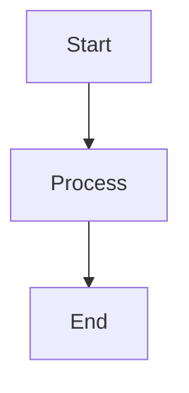
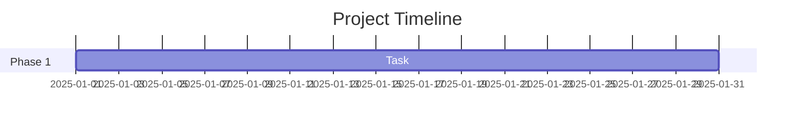
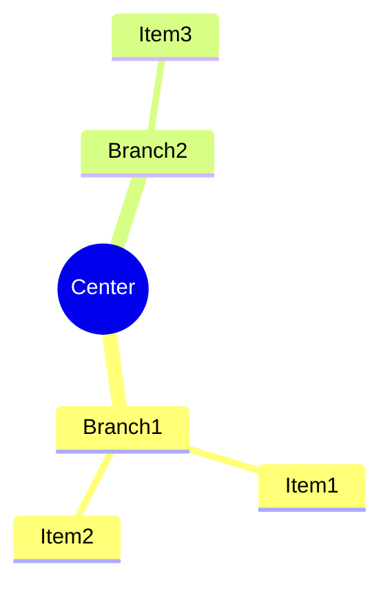

# 📖 Organization Profile Guide

## What is this?

This repository contains **high-tech, modern, stylish organization profile page examples** for GitHub. When you have a special `.github` repository in your organization, GitHub displays the `profile/README.md` file on your organization's public profile page.

---

## 📁 Files Included

### 1. **README.md** - Main Organization Profile
Located at: `profile/README.md`

This is the **main organization profile** that will be displayed on your GitHub organization page. It features:

- 🌌 **Stunning visual header** with animated elements
- 🚀 **Dynamic typing animations** showcasing your taglines
- ⚡ **Comprehensive technology stack** display with badges
- 🎨 **Featured projects** section with visual cards
- 📈 **GitHub statistics** integration
- 🔥 **Core competencies** showcase
- 🤝 **Community engagement** section with social links
- 📫 **Contact information** in an organized table
- 🏆 **Achievements & milestones** tracking
- 🎯 **2025 roadmap** with Gantt chart visualization
- 💜 **Custom color scheme** aligned with your brand

**Design Style**: High-tech, purple gradient theme, modern and professional

### 2. **EXAMPLES.md** - Multiple Style Variations
Located at: `profile/EXAMPLES.md`

This document provides **7 different design examples** you can choose from or mix-and-match:

1. **🌟 Minimalist Tech** - Clean, focused, simple design
2. **🎯 Cyberpunk/Futuristic** - Neon colors, ASCII art, terminal-style
3. **💎 Elegant Corporate** - Professional, trustworthy, enterprise-grade
4. **🌈 Creative & Colorful** - Vibrant, dynamic, visually rich
5. **🔬 Scientific & Data-Driven** - Academic, research-focused, citation-based
6. **🎮 Gaming/Interactive** - Fun, engaging, gamified elements
7. **🌌 Space/Cosmic Theme** - Stellar, expansive, mission-based

Each example includes:
- Complete markdown code
- Visual examples
- Customization suggestions
- Best use cases

**Plus**: Design elements library with badges, ASCII art, animations, and color schemes!

### 3. **GUIDE.md** - This Document
Located at: `profile/GUIDE.md`

Usage instructions and customization guide.

---

## 🚀 How to Use

### Option 1: Use the Main Profile (Recommended)
The `profile/README.md` is already configured and ready to use! It will automatically display on your organization page at:
```
https://github.com/Violet-Site-Systems
```

### Option 2: Customize with Examples
1. Open `profile/EXAMPLES.md`
2. Choose a design style that matches your brand
3. Copy the markdown code
4. Replace or merge with `profile/README.md`
5. Customize the content with your organization's information

### Option 3: Mix & Match
Combine elements from different examples to create your unique style:
- Use the header from one example
- Add the technology stack from another
- Mix in statistics from a third

---

## ✏️ Customization Guide

### 1. Update Organization Information

**Replace these placeholders**:
- Organization name: "Violet Site Systems"
- Tagline: "Bridging The Whispers Of AI"
- Links: Update all GitHub, social media, and email links
- Colors: Adjust the purple theme to match your brand

### 2. Update Technology Stack

Edit the technology badges in the stack section:
```markdown

```

Find badge codes at: https://shields.io/

### 3. Update GitHub Statistics

Replace `Violet-Site-Systems` with your organization username:
```markdown
?username=YOUR-ORG-NAME
```

### 4. Customize Colors

The main profile uses a purple gradient. To change:

**Current palette**:
```
#240046 #3C096C #560BAD #7209B7 #9D4EDD #C77DFF #E0AAFF
```

**Update these elements**:
- Capsule Render API color parameters
- Badge color codes
- Mermaid diagram styles
- Typing SVG colors

**Alternative color schemes** are provided in EXAMPLES.md!

### 5. Update Projects Section

Replace the featured projects table with your actual repositories:
```markdown
### 🤖 Your Project Name
*Brief description*

[](YOUR-REPO-URL)
```

### 6. Customize the Roadmap

Edit the Mermaid Gantt chart with your actual timeline:
```markdown
gantt
    title Your Roadmap Title
    dateFormat YYYY-MM
    section Your Section
    Your Task: START-DATE, DURATION
```

---

## 🎨 Design Elements Reference

### Animated Headers
```markdown

```

**Types**: waving, wave, cylinder, rect, soft, rounded, transparent, slice, venom, shark

### Typing Animations
```markdown
[](https://git.io/typing-svg)
```

### GitHub Stats
```markdown

```

**Themes**: radical, dark, merko, gruvbox, tokyonight, onedark, cobalt, synthwave, highcontrast, dracula

### Badges
```markdown

```

**Styles**: flat, flat-square, for-the-badge, plastic, social

---

## 📐 Layout Tips

### Centering Content
```markdown
<div align="center">
  Your content here
</div>
```

### Creating Tables
```markdown
<table>
<tr>
<td width="50%">Left column</td>
<td width="50%">Right column</td>
</tr>
</table>
```

### Adding Horizontal Rules
```markdown
---
```

### Creating Collapsible Sections
```markdown
<details>
<summary>Click to expand</summary>

Hidden content here

</details>
```

---

## 🔧 Advanced Features

### Mermaid Diagrams

**Flowcharts**:
```markdown

```

**Gantt Charts** (shown in main profile):
```markdown

```

**Mind Maps** (shown in EXAMPLES.md):
```markdown

```

### GitHub Actions Integration

Auto-update blog posts:
```markdown
<!-- BLOG-POST-LIST:START -->
<!-- BLOG-POST-LIST:END -->
```

Requires: [blog-post-workflow](https://github.com/gautamkrishnar/blog-post-workflow)

---

## 🎯 Best Practices

### ✅ Do's
- ✓ Keep content up-to-date
- ✓ Use high-quality visuals
- ✓ Ensure mobile responsiveness
- ✓ Test all links regularly
- ✓ Use consistent branding
- ✓ Include clear CTAs (Call-to-Actions)
- ✓ Add alt text for accessibility
- ✓ Keep load times reasonable

### ❌ Don'ts
- ✗ Overload with too many animations
- ✗ Use too many external images
- ✗ Neglect mobile users
- ✗ Include broken links
- ✗ Use outdated information
- ✗ Make it too text-heavy
- ✗ Ignore performance

---

## 📊 Testing Your Profile

### Preview Locally
Use a Markdown preview tool:
- VS Code Markdown Preview
- [Grip](https://github.com/joeyespo/grip) - GitHub Readme Instant Preview
- [Markdown Live Preview](https://markdownlivepreview.com/)

### Test on GitHub
1. Commit your changes
2. Visit your organization page
3. Check all visual elements load
4. Test all links
5. View on mobile devices

### Validate Elements
- [ ] Header displays correctly
- [ ] Animations work smoothly
- [ ] Badges render properly
- [ ] Statistics load (may take time initially)
- [ ] Links are functional
- [ ] Tables are formatted correctly
- [ ] Mermaid diagrams render
- [ ] Colors match your brand

---

## 🌐 External Services Used

The profile uses these external services for dynamic content:

1. **Capsule Render** - Animated headers
   - Service: https://capsule-render.vercel.app
   - Free to use

2. **Readme Typing SVG** - Typing animations
   - Service: https://readme-typing-svg.demolab.com
   - Free to use

3. **Shields.io** - Badges and shields
   - Service: https://shields.io
   - Free to use

4. **GitHub Readme Stats** - Statistics cards
   - Service: https://github-readme-stats.vercel.app
   - Free to use

5. **GitHub Streak Stats** - Contribution streaks
   - Service: https://github-readme-streak-stats.herokuapp.com
   - Free to use

**Note**: These services may have rate limits or availability issues. Consider hosting your own instances for production use.

---

## 🆘 Troubleshooting

### Images Not Loading
- Check if external services are operational
- Verify URL encoding (spaces should be %20)
- Ensure URLs use HTTPS

### Statistics Not Showing
- GitHub Readme Stats needs time to generate
- Organization stats may have delays
- Check if your organization profile is public

### Mermaid Diagrams Not Rendering
- Verify syntax is correct
- Check for proper code fence formatting
- Ensure using backticks (not quotes)

### Mobile Display Issues
- Use responsive table widths (percentages)
- Test center alignment
- Avoid fixed-width elements

---

## 📚 Additional Resources

### Tools
- [Shields.io](https://shields.io/) - Badge generator
- [Simple Icons](https://simpleicons.org/) - Brand icons
- [Mermaid Live Editor](https://mermaid.live/) - Diagram editor
- [Emoji Cheat Sheet](https://github.com/ikatyang/emoji-cheat-sheet) - GitHub emojis

### Inspiration
- [Awesome GitHub Profile README](https://github.com/abhisheknaiidu/awesome-github-profile-readme)
- [GitHub Profile README Generator](https://rahuldkjain.github.io/gh-profile-readme-generator/)
- [Awesome README](https://github.com/matiassingers/awesome-readme)

### Documentation
- [GitHub Organization Profile](https://docs.github.com/en/organizations/collaborating-with-groups-in-organizations/customizing-your-organizations-profile)
- [Markdown Guide](https://www.markdownguide.org/)
- [Mermaid Documentation](https://mermaid.js.org/)

---

## 🤝 Contributing

Found an issue or want to suggest improvements?

1. Check existing issues
2. Create a new issue with details
3. Submit a pull request

---

## 📄 License

Feel free to use, modify, and distribute these examples. Attribution appreciated but not required!

---

<div align="center">

**Happy Profiling!** 🎉

Made with 💜 for the GitHub Community

</div>
