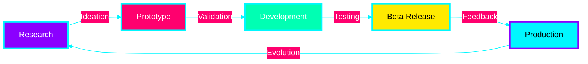

<div align="center">

```ascii
╔═══════════════════════════════════════════════════════════════════════════╗
║                                                                           ║
║   ██╗   ██╗██╗ ██████╗ ██╗     ███████╗████████╗                        ║
║   ██║   ██║██║██╔═══██╗██║     ██╔════╝╚══██╔══╝                        ║
║   ██║   ██║██║██║   ██║██║     █████╗     ██║                           ║
║   ╚██╗ ██╔╝██║██║   ██║██║     ██╔══╝     ██║                           ║
║    ╚████╔╝ ██║╚██████╔╝███████╗███████╗   ██║                           ║
║     ╚═══╝  ╚═╝ ╚═════╝ ╚══════╝╚══════╝   ╚═╝                           ║
║                                                                           ║
║      ███████╗██╗████████╗███████╗    ███████╗██╗   ██╗███████╗          ║
║      ██╔════╝██║╚══██╔══╝██╔════╝    ██╔════╝╚██╗ ██╔╝██╔════╝          ║
║      ███████╗██║   ██║   █████╗      ███████╗ ╚████╔╝ ███████╗          ║
║      ╚════██║██║   ██║   ██╔══╝      ╚════██║  ╚██╔╝  ╚════██║          ║
║      ███████║██║   ██║   ███████╗    ███████║   ██║   ███████║          ║
║      ╚══════╝╚═╝   ╚═╝   ╚══════╝    ╚══════╝   ╚═╝   ╚══════╝          ║
║                                                                           ║
╚═══════════════════════════════════════════════════════════════════════════╝
```

### **✨ Bridging The Whispers Of AI ✨**


[](https://github.com/Violet-Site-Systems)
[](https://discord.gg/violet-site-systems)
[](https://twitter.com/violetsitesys)

---

</div>

## 🌌 **ABOUT THE NEXUS**

<div align="center">

```
┌─────────────────────────────────────────────────────────────────┐
│  Violet-Site-Systems is an advanced technology collective       │
│  focused on bridging artificial intelligence with human         │
│  collaboration. We architect systems that understand context,    │
│  anticipate needs, and evolve with their users.                 │
│                                                                  │
│  Our mission: Transform how developers interact with AI-powered │
│  tools, creating seamless workflows that amplify human          │
│  creativity rather than replace it.                             │
└─────────────────────────────────────────────────────────────────┘
```

</div>

<div align="center">

## ⚡ **CORE TECHNOLOGIES**

</div>

<div align="center">


</div>

---

<div align="center">

## 🚀 **FLAGSHIP PROJECTS**

</div>

```
╔════════════════════════════════════════════════════════════════════╗
║                          PROJECT MATRIX                            ║
╠════════════════════════════════════════════════════════════════════╣
║                                                                    ║
║  🤖 AI-AGENT-FRAMEWORK                                            ║
║  ├─ Intelligent multi-agent orchestration system                  ║
║  ├─ Technologies: Python, TypeScript, LangChain                   ║
║  └─ Status: █████████░ 90% - Public Beta                         ║
║                                                                    ║
║  🌐 NEURAL-API-GATEWAY                                            ║
║  ├─ Self-optimizing API management with ML-based routing          ║
║  ├─ Technologies: Go, Rust, Kubernetes, Envoy                     ║
║  └─ Status: ███████░░░ 70% - Alpha Release                       ║
║                                                                    ║
║  ⚡ QUANTUM-CACHE-ENGINE                                          ║
║  ├─ Predictive caching with quantum-inspired algorithms           ║
║  ├─ Technologies: Rust, Redis, CUDA                               ║
║  └─ Status: █████░░░░░ 50% - Active Development                  ║
║                                                                    ║
║  🧠 COGNITIVE-CODE-ANALYZER                                       ║
║  ├─ AI-powered code review and architecture suggestions           ║
║  ├─ Technologies: Python, TensorFlow, TreeSitter                  ║
║  └─ Status: ███████░░░ 65% - Private Alpha                       ║
║                                                                    ║
║  🔐 ZERO-TRUST-MESH                                               ║
║  ├─ Distributed zero-trust security infrastructure                ║
║  ├─ Technologies: Rust, WebAssembly, eBPF                         ║
║  └─ Status: ████████░░ 80% - Beta Testing                        ║
║                                                                    ║
╚════════════════════════════════════════════════════════════════════╝
```

---

<div align="center">

## 📊 **SYSTEM METRICS**


</div>

---

<div align="center">

## 🎯 **ACTIVE DOMAINS**

</div>

<table align="center">
<tr>
<td align="center" width="25%">

### 🧬 **AI/ML**
```
Neural Networks
Deep Learning
NLP Processing
Computer Vision
Reinforcement Learning
```

</td>
<td align="center" width="25%">

### ☁️ **Cloud Native**
```
Microservices
Container Orchestration
Service Mesh
Serverless Computing
Edge Computing
```

</td>
<td align="center" width="25%">

### 🔒 **Security**
```
Zero Trust Architecture
Cryptography
Threat Detection
Blockchain Integration
Privacy Engineering
```

</td>
<td align="center" width="25%">

### 🎨 **DevEx**
```
Developer Tools
CI/CD Pipelines
Code Analysis
Documentation
Testing Frameworks
```

</td>
</tr>
</table>

---

<div align="center">

## 💫 **INNOVATION PIPELINE**



</div>

---

<div align="center">

## 🤝 **JOIN THE COLLECTIVE**


</div>

### **Ways to Contribute:**

```
┌──────────────────────────────────────────────────────────────┐
│                                                              │
│  🐛  Report Bugs & Issues                                   │
│  ├─ Help us identify and squash bugs                        │
│  └─ Open detailed issue reports                             │
│                                                              │
│  💡  Propose Features                                        │
│  ├─ Share your innovative ideas                             │
│  └─ Contribute to product roadmaps                          │
│                                                              │
│  🔧  Submit Pull Requests                                    │
│  ├─ Code improvements and new features                      │
│  └─ Documentation enhancements                              │
│                                                              │
│  📚  Improve Documentation                                   │
│  ├─ Write tutorials and guides                              │
│  └─ Translate content                                       │
│                                                              │
│  🎓  Share Knowledge                                         │
│  ├─ Write blog posts and case studies                       │
│  └─ Speak at conferences and meetups                        │
│                                                              │
└──────────────────────────────────────────────────────────────┘
```

### **Contribution Guidelines:**

1. **Fork** the repository you want to contribute to
2. **Create** a feature branch (`git checkout -b feature/AmazingFeature`)
3. **Commit** your changes (`git commit -m 'Add some AmazingFeature'`)
4. **Push** to the branch (`git push origin feature/AmazingFeature`)
5. **Open** a Pull Request with detailed description

---

<div align="center">

## 🌟 **COMMUNITY & SUPPORT**

[](https://github.com/orgs/Violet-Site-Systems/discussions)
[](https://stackoverflow.com/questions/tagged/violet-site-systems)
[](https://dev.to/violet-site-systems)

### **Support Channels:**

📧 Email: support@violet-site-systems.dev  
💬 Discord: [Join our community server](https://discord.gg/violet-site-systems)  
🐦 Twitter: [@VioletSiteSys](https://twitter.com/violetsitesys)  
📝 Blog: [tech.violet-site-systems.dev](https://tech.violet-site-systems.dev)

</div>

---

<div align="center">

## 🏆 **ACHIEVEMENTS & RECOGNITION**

```
╔═══════════════════════════════════════════════════════════╗
║                                                           ║
║  ⭐ 10K+ GitHub Stars Across Projects                    ║
║  👥 500+ Active Contributors                             ║
║  🔄 5K+ Merged Pull Requests                             ║
║  🌍 100+ Countries Represented                           ║
║  📦 1M+ Monthly Package Downloads                        ║
║  🎯 15+ Open Source Projects                             ║
║                                                           ║
╚═══════════════════════════════════════════════════════════╝
```

</div>

---

<div align="center">

## 🔮 **TECHNOLOGY PHILOSOPHY**

</div>

> ### *"Technology should amplify human potential, not replace it."*

<div align="center">

```
┌────────────────────────────────────────────────────────────────┐
│                                                                │
│  We believe in:                                                │
│                                                                │
│  ◆ Ethical AI Development                                     │
│  ◆ Open Source Collaboration                                  │
│  ◆ Privacy-First Engineering                                  │
│  ◆ Sustainable Technology                                     │
│  ◆ Inclusive Innovation                                       │
│  ◆ Continuous Learning                                        │
│                                                                │
└────────────────────────────────────────────────────────────────┘
```

</div>

---

<div align="center">

## 📜 **OPEN SOURCE LICENSES**


**All projects are licensed under OSI-approved licenses**  
View individual project repositories for specific licensing details

</div>

---

<div align="center">

## 🛡️ **SECURITY & COMPLIANCE**


**Security Policy:** [SECURITY.md](./SECURITY.md)  
**Report Vulnerabilities:** security@violet-site-systems.dev  
**Bug Bounty Program:** [bounty.violet-site-systems.dev](https://bounty.violet-site-systems.dev)

</div>

---

<div align="center">

```ascii
╔═══════════════════════════════════════════════════════════════════════════╗
║                                                                           ║
║   "Building the infrastructure for tomorrow's intelligent systems"       ║
║                                                                           ║
║              🌟 Star our repos | 🔄 Fork & Contribute | 💬 Join Us       ║
║                                                                           ║
╚═══════════════════════════════════════════════════════════════════════════╝
```


---

### **Powered by Innovation • Driven by Community • Secured by Design**


---

**© 2024 Violet-Site-Systems • All Rights Reserved**

</div>
