<div align="center">

# 🌌 Welcome to Violet Site Systems

### *Bridging The Whispers Of AI*


[](https://git.io/typing-svg)

</div>

---

## 🚀 About Us

<table>
<tr>
<td width="50%">

### 💡 Our Vision
We're pioneering the intersection of **artificial intelligence** and **modern web technologies** to create systems that don't just respond—they *understand*.

</td>
<td width="50%">

### 🎯 Our Mission
Delivering cutting-edge solutions that bridge human creativity with machine intelligence, making technology more accessible and powerful.

</td>
</tr>
</table>

---

## ⚡ Technology Stack

<div align="center">

### Frontend


### Backend & AI


### Infrastructure


</div>

---


## 🌟 What We Do

```mermaid
graph LR
    A[💡 Innovation] -->|Research| B[🔬 Development]
    B -->|Build| C[🚀 Deployment]
    C -->|Iterate| D[📊 Analytics]
    D -->|Optimize| A
    
    style A fill:#9D4EDD,stroke:#7209B7,stroke-width:2px,color:#fff
    style B fill:#7209B7,stroke:#560BAD,stroke-width:2px,color:#fff
    style C fill:#560BAD,stroke:#3C096C,stroke-width:2px,color:#fff
    style D fill:#3C096C,stroke:#240046,stroke-width:2px,color:#fff
```

<div align="center">



</div>


### 🧬 **AI/ML**
```
Neural Networks
Deep Learning
NLP Processing
Computer Vision
Reinforcement Learning
```

</td>
<td align="center" width="25%">

### ☁️ **Cloud Native**
```
Microservices
Container Orchestration
Service Mesh
Serverless Computing
Edge Computing
```

</td>
<td align="center" width="25%">

### 🔒 **Security**
```
Zero Trust Architecture
Cryptography
Threat Detection
Blockchain Integration
Privacy Engineering
```

</td>
<td align="center" width="25%">

### 🎨 **DevEx**
```
Developer Tools
CI/CD Pipelines
Code Analysis
Documentation
Testing Frameworks
```

</td>
</tr>
</table>

---

## 🤝 Join Our Community

<div align="center">

### We're always looking for passionate contributors!


[](https://twitter.com/colleenpridemor)
[](https://linkedin.com/in/colleenpridemore)
[](https://medium.com/colleenpridemore)

</div>

### 💼 Get Involved

<div align="center">

| 🌱 Contributor | 🐛 Bug Hunter | 📝 Writer | 🎨 Designer |
|:---:|:---:|:---:|:---:|
| Submit PRs | Report Issues | Share Knowledge | Create Assets |

</div>

---

## 📫 Contact Us

<div align="center">

### Let's build something amazing together!

<table>
<tr>
<td align="center" width="33%">
  
### 💌 Email
[info@violetsitesystems.com](mailto:info@violetsitesystems.com)

</td>

</table>
<div align="center">

## 💫 **INNOVATION PIPELINE**


</div>

---

<div align="center">

## 🤝 **JOIN THE COLLECTIVE**


</div>

### **Ways to Contribute:**

```
┌──────────────────────────────────────────────────────────────┐
│                                                              │
│  🐛  Report Bugs & Issues                                   │
│  ├─ Help us identify and squash bugs                        │
│  └─ Open detailed issue reports                             │
│                                                              │
│  💡  Propose Features                                        │
│  ├─ Share your innovative ideas                             │
│  └─ Contribute to product roadmaps                          │
│                                                              │
│  🔧  Submit Pull Requests                                    │
│  ├─ Code improvements and new features                      │
│  └─ Documentation enhancements                              │
│                                                              │
│  📚  Improve Documentation                                   │
│  ├─ Write tutorials and guides                              │
│  └─ Translate content                                       │
│                                                              │
│  🎓  Share Knowledge                                         │
│  ├─ Write blog posts and case studies                       │
│  └─ Speak at conferences and meetups                        │
│                                                              │
└──────────────────────────────────────────────────────────────┘
```

### **Contribution Guidelines:**

1. **Fork** the repository you want to contribute to
2. **Create** a feature branch (`git checkout -b feature/AmazingFeature`)
3. **Commit** your changes (`git commit -m 'Add some AmazingFeature'`)
4. **Push** to the branch (`git push origin feature/AmazingFeature`)
5. **Open** a Pull Request with detailed description

---

<div align="center">

## 🌟 **COMMUNITY & SUPPORT**

[](](https://github.com/Violet-Site-Systems/DAC/discussions))


> *Note: Update these links with actual URLs when platforms are established*

📧 Email: info@violetsitesystems.com  
📝 Blog: [https://www.violetsitesystems.com/blog(https://www.violetsitesystems.com/blog)

</div>


## 🌈 Color Palette

<div align="center">

Our signature colors represent innovation, creativity, and technology:


<div align="center">

## 🔮 **TECHNOLOGY PHILOSOPHY**

</div>

> ### *"Technology should amplify human potential, not replace it."*

<div align="center">

```
┌────────────────────────────────────────────────────────────────┐
│                                                                │
│  We believe in:                                                │
│                                                                │
│  ◆ Ethical AI Development                                     │
│  ◆ Open Source Collaboration                                  │
│  ◆ Privacy-First Engineering                                  │
│  ◆ Sustainable Technology                                     │
│  ◆ Inclusive Innovation                                       │
│  ◆ Continuous Learning                                        │
│                                                                │
└────────────────────────────────────────────────────────────────┘
```

</div>

---

## 📊 Weekly Development Breakdown

<div align="center">

```text
TypeScript   ████████████████░░░░░   75.2 %
Python       ████░░░░░░░░░░░░░░░░░   15.8 %
JavaScript   ██░░░░░░░░░░░░░░░░░░░    5.5 %
CSS          █░░░░░░░░░░░░░░░░░░░░    2.3 %
Other        █░░░░░░░░░░░░░░░░░░░░    1.2 %
```
<div align="center">

## 📜 **OPEN SOURCE LICENSES and Sustinability AI Governance LICENSES**


</div>

---

## 🎯 2025 Roadmap

<div align="center">


<div align="center">

## 🛡️ **SECURITY & COMPLIANCE**


**Security Policy:** [SECURITY.md](./SECURITY.md)  
**Report Vulnerabilities:** security@violet-site-systems.dev  
**Bug Bounty Program:** [bounty.violet-site-systems.dev](https://bounty.violet-site-systems.dev)

</div>

---

<div align="center">

```ascii
╔═══════════════════════════════════════════════════════════════════════════╗
║                                                                           ║
║   "Building the infrastructure for tomorrow's intelligent systems"       ║
║                                                                           ║
║              🌟 Star our repos | 🔄 Fork & Contribute | 💬 Join Us       ║
║                                                                           ║
╚═══════════════════════════════════════════════════════════════════════════╝
```


---

### **Powered by Innovation • Driven by Community • Secured by Design**


---

**© 2024 Violet-Site-Systems • All Rights Reserved**

</div>
