<div align="center">

# 🌌 Welcome to Violet Site Systems

### *Bridging The Whispers Of AI*


[](https://git.io/typing-svg)

</div>

---

## 🚀 About Us

<table>
<tr>
<td width="50%">

### 💡 Our Vision
We're pioneering the intersection of **artificial intelligence** and **modern web technologies** to create systems that don't just respond—they *understand*.

</td>
<td width="50%">

### 🎯 Our Mission
Delivering cutting-edge solutions that bridge human creativity with machine intelligence, making technology more accessible and powerful.

</td>
</tr>
</table>

---

## ⚡ Technology Stack

<div align="center">

### Frontend


### Backend & AI


### Infrastructure


</div>

---

## 🎨 Featured Projects

<div align="center">

<table>
<tr>
<td width="33%" align="center">
  
### 🤖 AI Assistant Platform
*Intelligent conversational systems*

[](https://github.com/Violet-Site-Systems)


</td>
<td width="33%" align="center">
  
### 🌐 Modern Web Framework
*Next-gen site building tools*

[](https://github.com/Violet-Site-Systems)


</td>
<td width="33%" align="center">
  
### 📊 Data Visualization Suite
*Beautiful analytics dashboards*

[](https://github.com/Violet-Site-Systems)


</td>
</tr>
</table>

</div>

---

## 📈 GitHub Statistics

<div align="center">


</div>

<div align="center">

</div>

---

## 🌟 What We Do

```mermaid
graph LR
    A[💡 Innovation] -->|Research| B[🔬 Development]
    B -->|Build| C[🚀 Deployment]
    C -->|Iterate| D[📊 Analytics]
    D -->|Optimize| A
    
    style A fill:#9D4EDD,stroke:#7209B7,stroke-width:2px,color:#fff
    style B fill:#7209B7,stroke:#560BAD,stroke-width:2px,color:#fff
    style C fill:#560BAD,stroke:#3C096C,stroke-width:2px,color:#fff
    style D fill:#3C096C,stroke:#240046,stroke-width:2px,color:#fff
```

<div align="center">



</div>

### 🔥 Core Competencies

<table>
<tr>
<td width="50%">

#### 🧠 AI & Machine Learning
- Natural Language Processing
- Computer Vision Systems
- Predictive Analytics
- Deep Learning Models
- LLM Integration

</td>
<td width="50%">

#### 💻 Web Development
- Progressive Web Apps
- Responsive Design Systems
- API Architecture
- Real-time Applications
- Cloud-Native Solutions

</td>
</tr>
<tr>
<td width="50%">

#### 🔐 Security & Privacy
- Zero-Trust Architecture
- End-to-End Encryption
- GDPR Compliance
- Security Audits
- Penetration Testing

</td>
<td width="50%">

#### 📱 DevOps & CI/CD
- Automated Deployment
- Infrastructure as Code
- Container Orchestration
- Monitoring & Logging
- Performance Optimization

</td>
</tr>
</table>

---

## 🤝 Join Our Community

<div align="center">

### We're always looking for passionate contributors!

[](https://discord.gg)
[](https://twitter.com)
[](https://linkedin.com)
[](https://medium.com)

</div>

### 💼 Get Involved

<div align="center">

| 🌱 Contributor | 🐛 Bug Hunter | 📝 Writer | 🎨 Designer |
|:---:|:---:|:---:|:---:|
| Submit PRs | Report Issues | Share Knowledge | Create Assets |

</div>

---

## 📫 Contact Us

<div align="center">

### Let's build something amazing together!

<table>
<tr>
<td align="center" width="33%">
  
### 💌 Email
[hello@violetsystems.tech](mailto:hello@violetsystems.tech)

</td>
<td align="center" width="33%">
  
### 💼 Business
[business@violetsystems.tech](mailto:business@violetsystems.tech)

</td>
<td align="center" width="33%">
  
### 🔒 Security
[security@violetsystems.tech](mailto:security@violetsystems.tech)

</td>
</tr>
</table>

</div>

---

## 🏆 Achievements & Milestones

<div align="center">


### 🎖️ Recognition

| 🏅 Award | 📅 Year | 🎯 Category |
|---------|---------|-------------|
| Best Open Source Project | 2024 | Innovation |
| Top AI Implementation | 2024 | Technology |
| Community Choice Award | 2023 | Collaboration |

</div>

---

## 📚 Latest Blog Posts

<!-- BLOG-POST-LIST:START -->
- 🚀 Building Scalable AI Systems with Modern Architecture
- 🎨 The Future of Web Design: AI-Powered Interfaces
- 🔐 Security Best Practices for AI Applications
- 💡 From Concept to Production: Our Development Journey
<!-- BLOG-POST-LIST:END -->

---

## 🌈 Color Palette

<div align="center">

Our signature colors represent innovation, creativity, and technology:


</div>

---

## 📊 Weekly Development Breakdown

<div align="center">

```text
TypeScript   ████████████████░░░░░   75.2 %
Python       ████░░░░░░░░░░░░░░░░░   15.8 %
JavaScript   ██░░░░░░░░░░░░░░░░░░░    5.5 %
CSS          █░░░░░░░░░░░░░░░░░░░░    2.3 %
Other        █░░░░░░░░░░░░░░░░░░░░    1.2 %
```

</div>

---

## 🎯 2025 Roadmap

<div align="center">


</div>

---

<div align="center">

### ⭐ Star our repositories to support open source!


**Made with 💜 by the Violet Site Systems Team**

*Last Updated: December 2024*

</div>
